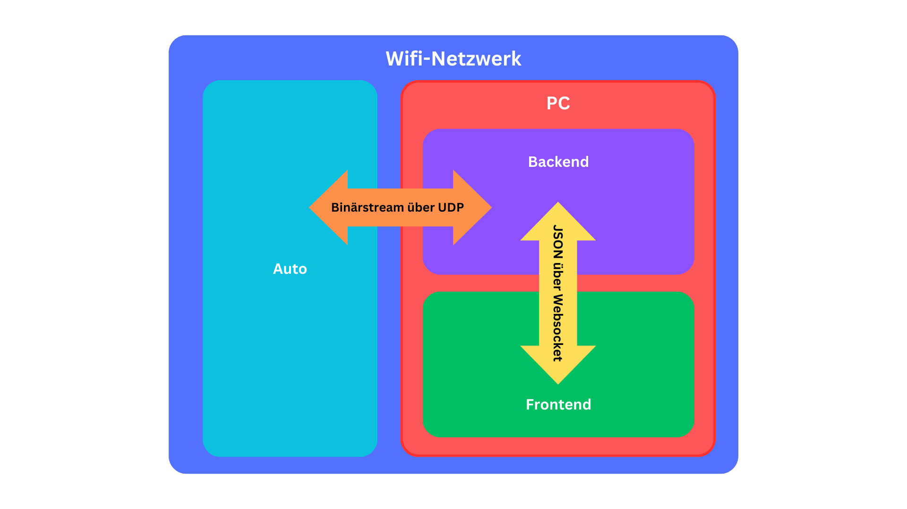

# Dokumentation- Grafiken

## Inhaltsverzeichnis
1. [Einführung](#einführung)
2. [Projektstrukturplan](#projektstrukturplan)
3. [Kommunikationsmodell](#kommunikationsmodell)

## Einführung
Diese Dokumentation beschreibt die Kommunikationsmodelle, die Systemarchitektur und den Projektstrukturplan des RC-Car Projekts. Detaillierte Grafiken veranschaulichen die Datenflüsse, Schnittstellen und die systematische Gliederung der Projektaufgaben.

## Projektstrukturplan
Ein Projektstrukturplan (PSP) ist essenziell für den Erfolg eines Projekts, da er die Grundlage für eine strukturierte und transparente Planung sowie eine effiziente Zusammenarbeit bildet.

Der Projektstrukturplan (PSP) dieses Projektes stellt die systematische Gliederung in plan- und steuerbare Teilaufgaben dar, um eine effiziente Projektabwicklung zu gewährleisten.
Der vorliegende PSP für das RC-Car Projekt umfasst folgende Hauptbereiche: Hardware, Autosoftware, Desktop-Anwendung und Desktop-Anwendung Backend sowie Desktop-Anwendung Lenkradsteuerung. Jeder dieser Hauptbereiche ist weiter in spezifische Aufgaben unterteilt, die zur erfolgreichen Umsetzung des Projektes erforderlich sind.

## Kommunikationsmodell
Die Kommunikation innerhalb des RC-Car Projekts erfolgt über ein drahtloses Netzwerk und umfasst zwei Hauptmodelle zur Datenübertragung:

Im ersten Modell kommuniziert das Auto via UDP mit dem PC-Backend, während JSON-Daten über Websockets zwischen Backend und Frontend übertragen werden. 

Das zweite Modell zeigt eine detaillierte Darstellung, bei der das Auto, das Backend, das Lenkrad und das Frontend über UDP und Websockets verbunden sind. 

