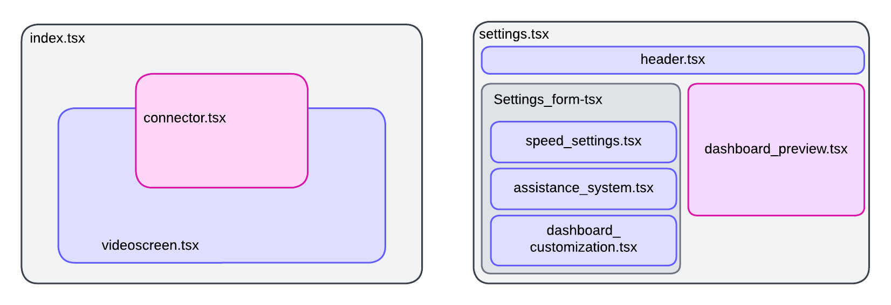
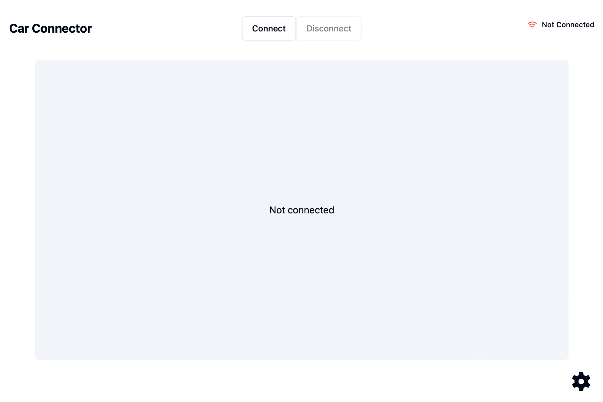
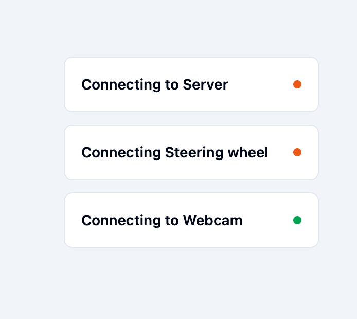
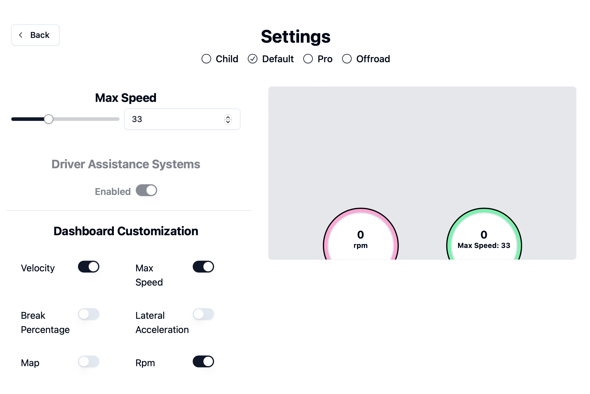

# Frontend-Dokumentation

## Inhaltsverzeichnis
1. [Einführung](#einführung)
2. [Projektstruktur](#projektstruktur)
3. [Installation](#installation)
4. [Verwendung](#verwendung)
    - [Auto-Steuerung](#auto-steuerung)
    - [Live-Video-Stream](#live-video-stream)
5. [Frontend-Komponenten](#frontend-komponenten)
    - [ControllerComponent](#controllercomponent)
    - [VideoStreamComponent](#videostreamcomponent)
6. [Tauri](#tauri)
7. [Fehlerbehebung](#fehlerbehebung)
8. [Mitwirken](#mitwirken)
9. [Lizenz](#lizenz)

*Achtung: Sollte Schritt 5 zu Problemen führen, müssen ggf. Execution_Policies angepasst werden. Hierzu ```Set-ExecutionPolicy -Scope CurrentUser -ExecutionPolicy Unrestricted``` ausführen.*

## Einführung
Dieses Projekt ist eine Softwarelösung, die es ermöglicht, ein Auto per Racing Lenkrad zu steuern und einen Live-Video-Stream im Frontend anzuzeigen. 

Diese Dokumentation bezieht sich lediglich auf das Frontend des Projektes und seine Funktionalitäten.

### Technologie-Stack

1. React

   React ist eine beliebte JavaScript-Bibliothek zur Erstellung von Benutzeroberflächen, insbesondere von Single-Page-Anwendungen, bei denen sich Daten häufig ändern. In diesem Projekt wird React aus folgenden Gründen verwendet:

   - Komponentenbasierte Architektur: Die komponentenbasierte Struktur von React ermöglicht wiederverwendbare UI-Komponenten, wodurch der Code modularer und einfacher zu warten ist.
   - Deklarative UI: React ermöglicht die deklarative UI-Entwicklung, was den Prozess der Gestaltung interaktiver und dynamischer Benutzeroberflächen vereinfacht.
   - Virtueller DOM: Der virtuelle DOM von React verbessert die Leistung, indem er die direkte Manipulation des tatsächlichen DOM minimiert und somit schnellere UI-Updates ermöglicht.
   - Tailwind CSS: Tailwind ist ein vielseitiges CSS-Framework, das die Entwicklung von anpassbaren und reaktionsfähigen Designs beschleunigt. Es ermöglicht es, direkt in den Klassenstilen zu arbeiten, was die Entwicklungszeit verkürzt und die Konsistenz erhöht.
   - ShadCN: ShadCN ist eine Bibliothek, die speziell dafür entwickelt wurde, um mit React und Tailwind zu arbeiten. Sie bietet eine Sammlung von vorgefertigten UI-Komponenten, die nahtlos in das Projekt integriert werden können und die Entwicklung von Benutzeroberflächen weiter beschleunigen.
   - Zustand: Dies ist eine Lösung zum Statemanagement in React, es wird ein globaler Store erstellt, in dem alle Daten der Anwendung gespeichert sind, dadurch können Daten im Store geändert werden und die neuen Daten sind an allen Stellen direkt vorhanden wo sie aus dem Store ausgelesen werden. Somit müssen Daten vom Backend nicht doppelt geladen werden, da sie durch den store global verfügbar sind.

2. Vite

   Vite ist ein modernes Frontend-Tooling, das auf Geschwindigkeit und Leistung ausgelegt ist. Es wird in diesem Projekt aus folgenden Gründen verwendet:

   - Schneller Entwicklungsserver: Vite bietet einen extrem schnellen Entwicklungsserver mit sofortigem Hot Module Replacement (HMR), was den Entwicklungsprozess erheblich beschleunigt.
   - Optimierter Build: Vite nutzt moderne JavaScript-Funktionen, um einen optimierten Build-Prozess mit schnelleren Builds und kleineren Bundle-Größen zu ermöglichen.
   - Einfache Integration: Die Konfiguration von Vite ist einfach und lässt sich nahtlos in React integrieren, was es zu einer idealen Wahl für dieses Projekt macht.


3. Tauri

   Tauri ist ein Framework zur Erstellung kleiner, schneller Binärdateien für alle wichtigen Desktop-Plattformen. Es wird in diesem Projekt verwendet, um eine Desktop-Anwendung zur Steuerung des RC-Autos zu erstellen. Die Gründe für die Wahl von Tauri sind:

   - Plattformübergreifend: Tauri ermöglicht die Erstellung plattformübergreifender Desktop-Anwendungen aus einer einzigen Codebasis und unterstützt Windows, macOS und Linux.
   - Sicherheit: Tauri bietet eine sicherheitsorientierte Umgebung, die sicherstellt, dass die Anwendung standardmäßig sicher ist.
   - Leichtgewichtig: Tauri-Anwendungen sind im Vergleich zu traditionellen Electron-Anwendungen extrem leichtgewichtig, da sie keine vollständige Webbrowser-Engine mitbringen.
   - Rust-Integration: Tauri verwendet Rust für das Backend, was hohe Leistung und Zuverlässigkeit bietet. Die Speichersicherheitsfunktionen von Rust helfen, häufige Fehler und Sicherheitslücken zu verhindern.


4. Rust

   Rust ist eine Systemprogrammiersprache, die für ihre Leistung und Sicherheit bekannt ist. Sie wird in diesem Projekt verwendet, um das Backend der Tauri-Anwendung zu erstellen. Die Gründe für die Wahl von Rust sind:

   - Leistung: Rust bietet eine Leistung, die mit C und C++ vergleichbar ist, und ist daher ideal für ressourcenintensive Anwendungen.
   - Sicherheit: Das Ownership-System von Rust gewährleistet Speichersicherheit, ohne dass ein Garbage Collector erforderlich ist, und verringert das Risiko von Speicherlecks und anderen häufigen Fehlern.
   - Nebenläufigkeit: Das Nebenläufigkeitsmodell von Rust erleichtert das Schreiben von sicherem und effizientem nebenläufigem Code, was für die Verarbeitung von Echtzeitdaten vom RC-Auto von Vorteil ist. 

   
#### Fazit

Die Kombination aus React, Vite, Tauri und Rust bietet einen leistungsstarken und effizienten Technologie-Stack zur Entwicklung einer Desktop-Anwendung zur Steuerung eines RC-Autos. React und Vite kümmern sich um das Frontend und bieten eine schnelle und reaktionsfähige Benutzeroberfläche, während Tauri und Rust eine leichtgewichtige, sichere und leistungsstarke Desktop-Anwendung gewährleisten. Dieser Technologie-Stack verbessert nicht nur das Entwicklungserlebnis, sondern stellt auch eine robuste und benutzerfreundliche Anwendung für die Endnutzer sicher.

## Projektstruktur
```plaintext
app/
├── src/
│   ├── components/
│   │   ├── ui/
│   │   ├── assistance_systems.tsx
│   │   ├── connector.tsx
│   │   └── ...
│   ├── lib/
│   │   ├── store.ts
│   │   ├── ...
│   ├── main.tsx
│   └── ...
├── src-tauri/
│   ├── src/
│   │   ├── main.rs
│   ├── tauri.conf.json
│   └── ...
├── index.html
├── package.json
├── pnpm-lock.yaml
└── ...
```

## Installation

### Vorraussetzungen
- Node.js (>= 14.x)
- Rust 1.79.0
- ffmpeg

#### Installationsschritte
1. Repository klonen (falls noch nicht geschehen):
    ```bash
    git clone https://github.com/benutzername/repo-name.git
    cd app
    ```
2. node installieren [download](https://nodejs.org/en)

3. Rust installieren (falls noch nicht installiert):
   Folgen Sie den Anweisungen auf [rust-lang.org](https://www.rust-lang.org/).
   (Bei Windows wird C++ Compiler hierfür benötigt, auswählbar in VS Installation)
4. pnpm installieren
   ```
   npm i -g pnpm
   ```

5. Abhängigkeiten installieren:
    ```bash
    pnpm i
    ```

6. Tauri-App bauen:
   hier wird die App lediglich gebaut (gebuilded), nicht gestartet
   ```bash
    pnpm tauri build
    ```
   Die gebaute App kann dann mit der `src-tauri/target/release/<app_name>` Executable gestartet werden.


7. Tauri-App im Developmentmodus starten:
    ```bash
    pnpm tauri dev
    ```

## Verwendung
<p style="text-align: justify;">
Die Frontend Anwendung dient zur Visualisierung des Fahrerlebnisses.
</p>


## Frontend-Komponenten
<p style="text-align: justify;">
Das Frontend besteht aus zwei Hauptkomponenten, der Startseite (index.tsx) und den Einstellungen (settings.tsx).
Beide Seiten bestehen aus mehrern React-Komponenten. Der Aufbau wird in folgender Abbildung verdeutlicht:




Im Folgenden werden die oben zu sehenden Komponenten genauer erläutert.
</p>

### index.tsx

<p style="text-align: justify;">
Hierbei handelt es sich um die Hauptkomponente der App, sie ist gleichzeitig die Startseite.

Die Seite besteht aus zwei Hauptkomponenten, dem Videoscreen (videoscreen.tsx) und einer Komponente, die den Verbindungsfortschritt zu RC-Auto und Kamera anzeigt (connector.tsx).

Folgende Abbildung zeigt die Startseite:



Durch Betätigen des "Connect"-Buttons ist es dem User möglich sich zu den anderen Komponenten des Projekts 
( Auto bzw. hier dem Websocket-Server, welcher die Fahrdaten liefert und Live Kamera).
Es erscheint eine Verbindungsfortschrittanzeigen (hierzu später mehr), sobald alle Verbindungen hergestellt wurde, wird der Live-Kamera Feed in der Videoscreen-Komponente angezeigt.

Durch Betätigen des "Disconnect"-Buttons werden die Verbindungen getrennt, dementsprechend werden weder Kamera-Feed noch Live-Daten des RC-Autos angezeigt.

Desweiteren kann der User über das Settings-Symbol unten rechts auf die Einstellungen zugreifen (settings.tsx).
Diese Funktion ist jedoch lediglich bei hergestellter Verbindung möglich.

</p>

### connector.tsx

Dieses React-Component ist für die Visualisierung der Verbindung zum Backend (Websocket-Server) und zur Kamera zuständig.

<div style="text-align: center;">

</div>


### videoscreen.tsx

Diese Komponente dient zum Abrufen und Anzeigen des Live Kamera Feeds.

Zudem werden hier die Geschwindigkeit, die Drehzahl und weitere Livedaten angezeigt.


### settings.tsx

Die Settings-Komponente ist die zweite "page" der Anwendung. Hier hat der Nutzer verschiedene Einstellungsmöglichkeiten.

Die Seite besteht aus 5 kleineren Komponenten, die jeweils eine Hauptfunktionalität besitzen. Diese Aufteilung bewirkt, dass der Code modularer, leichter zu warten und wiederverwendbar ist, da jede Komponente klar abgegrenzte Aufgaben hat und unabhängig von den anderen entwickelt und getestet werden kann. 
Zudem ermöglicht es eine bessere Skalierbarkeit und vereinfacht die Fehlersuche, da Probleme auf einzelne Komponenten isoliert werden können.

Folgende Abbildung zeigt die vollständige Einstellungsseite:




### header.tsx

Dieses Component stellt, wie der Name schon sagt, den Header der Settingspage dar. Er besteht aus der Überschrift "Settings", dem Navigationsbutton zurück zur index.tsx und der Auswahl der Fahrmodi.
Der Fahrmodus wird durch klicken der Checkbox ausgewählt. Je nach Modus kann der Benutzer mehr oder weniger Einstellungen treffen. Beispielsweise lassen sich die Assistenzsysteme nur ausschalten, sollte der Modus "Pro" ausgwählt sein.
Der ausgewählte Fahrmodus wird durch eine neu getroffene Auswahl automatisch per Websocket-Verbindung an das Backend geschickt und dort weiter verarbeitet. Darum ist es zwingend notwendig, dass vor Änderung einer Einstellung bereits eine Verbindung zum Backend besteht. Dies ist dadurch gegeben, dass sich die Seite nur öffnen lässt, sollte eine Verbindung established sein.

### settings_form.tsx

Dieses Component managed alle Einstellungen, die in der Anwendung getroffen werden können.
wird unterteilt in speed_settings, assistance_system und dashboard_customization.

### speed_settings.tsx

Hier kann der Nutzer die maximal mögliche Geschwindigkeit, die das RC-Auto fahren kann, einstellen. Sobald diese geändert wird, egal, ob durch Eingabe einer Zahl in das Inputfeld oder durch Bewegen des "Sliders", wird diese Information über die Websocket-Verbindung an das Backend gesendet.

### assistance_system

Dieses Component besteht aus einer Überschrift "Driver Assistance Systems" und einem "Switch", durch welchen sich die Fahrerassistenzsysteme an- und ausschalten lassen. Bei einer Änderung des Schalters wird dies ebenfalls an das Backend gesendet und die Information weiter verarbeitet.
Wichtig zu Erwähnen ist hier, dass ein Ausschalten der Assistenzsysteme nur möglich ist, wenn sich das RC-Auto im Modus "Pro" befindet.

## Tauri und Rust

Tauri ist ein Crossplattform (Mac, Windows und Linux) Desktopbundler, welcher es uns ermöglicht,
Webanwendungen als Executables zu bauen, und diese als "normale" Anwendungen auf unserem Computer zu starten.
Dies erfolgt mithilfe der Webview Plattform. Innerhalb unserer Anwendung laufen zwei Prozesse, der Webview Prozess, zum Anzeigen der UI, 
und der Tauri Prozess, mit dem durch Eventemitter, Funktionen aus dem Frontend in dem Tauri-Rust Backend aufgerufen werden können.
So wird zum Beispiel in unserer Anwendung ein RSP-Stream in ein für das Frontend nutzbares Format geändert.

[//]: # (TODO: add main.rs)

### Stream 

Rust wird neben dem Starten der Anwendung ebenfalls zum Abrufen und prüfen des Live  Streams verwendet.

Bei dem Stream handelt es sich um einen rsp-stream, der direkt vom RC-Auto bzw vom darin verbauten Rasberry Pi gesendet wird.
Da dieses Format nicht direkt über einen Browser abrufbar ist, wird dieser mithilfe von FFMPEG in das Videoformat h256 umgewandelt, und dann über einen Rust-Webserver dem Frontend zur Verfügung gestellt, sodass das Livebild
des Autos in der Anwendung angezeigt werden kann. Zum starten des FFMPEG Prozesses, der die Videodateien umwandelt, wird ebenfalls Rust benutzt.


