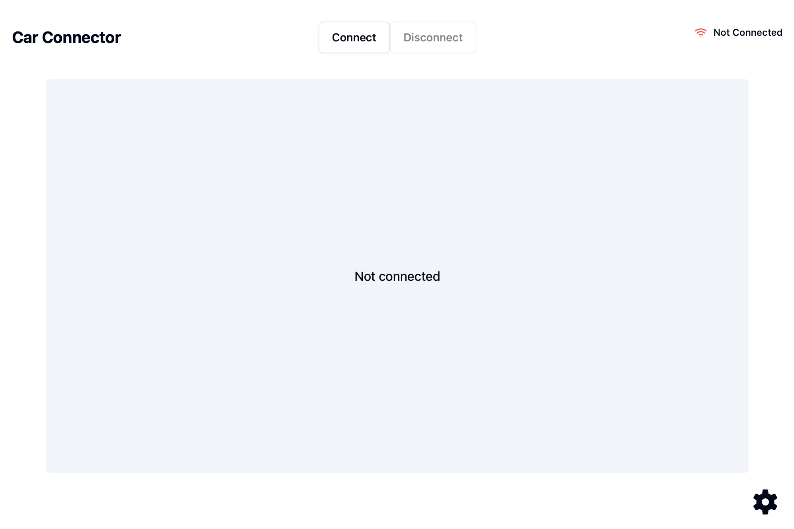
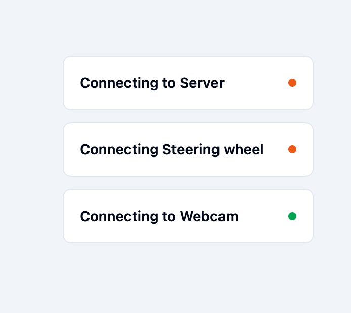

# Frontend-Documentation

## Introduction

This project is a software solution that allows controlling a car with a racing wheel and displaying a live video stream in the frontend. 


This documentation pertains solely to the frontend of the project and its functionalities.

### Technologie-Stack

**1. React**

   React is a popular JavaScript library for building user interfaces, particularly single-page applications where data changes frequently. In this project, React is used for the following reasons:

   - Component-Based Architecture: React's component-based structure allows for reusable UI components, making the code more modular and easier to maintain.
   - Declarative UI: React enables declarative UI development, simplifying the process of designing interactive and dynamic user interfaces.
   - Virtual DOM: React's virtual DOM improves performance by minimizing direct manipulation of the actual DOM, leading to faster UI updates.
   - Tailwind CSS: Tailwind is a versatile CSS framework that accelerates the development of customizable and responsive designs. It allows working directly in class styles, reducing development time and increasing consistency.
   - ShadCN: ShadCN is a library specifically designed to work with React and Tailwind. It provides a collection of pre-built UI components that can be seamlessly integrated into the project, further speeding up the development of user interfaces.
   - Zustand: This is a state management solution in React. It creates a global store where all application data is stored, allowing data in the store to be updated and immediately available wherever it is accessed from the store. This means that data from the backend does not need to be loaded multiple times, as it is globally available through the store.

**2. Vite**

   Vite is a next-generation frontend tooling focused on speed and performance. It is used in this project for the following reasons:

   - Fast Development Server: Vite provides an extremely fast development server with instant hot module replacement (HMR), significantly speeding up the development process.
   - Optimized Build: Vite leverages modern JavaScript features to provide an optimized build process with faster builds and smaller bundle sizes.
   - Easy Integration: Vite's configuration is straightforward and integrates seamlessly with React, making it an ideal choice for this project.

**3. Tauri**

   Tauri is a framework for building tiny, fast binaries for all major desktop platforms. It is used in this project to create a desktop application for controlling the RC car. The reasons for choosing Tauri include:

   - Cross-Platform: Tauri allows the creation of cross-platform desktop applications from a single codebase, supporting Windows, macOS, and Linux.
   - Security: Tauri provides a security-focused environment, ensuring that the application is secure by default.
   - Lightweight: Tauri applications are extremely lightweight compared to traditional Electron applications, as they do not bundle a full web browser engine.
   - Rust Integration: Tauri uses Rust for the backend, which provides high performance and reliability. Rust's memory safety features help prevent common bugs and security vulnerabilities.

**4. Rust**

   Rust is a systems programming language known for its performance and safety. It is used in this project to build the backend of the Tauri application. The reasons for choosing Rust include:

   - Performance: Rust provides performance comparable to C and C++, making it ideal for resource-intensive applications.
   - Safety: Rust's ownership system ensures memory safety without needing a garbage collector, reducing the risk of memory leaks and other common bugs.
   - Concurrency: Rust's concurrency model makes it easier to write safe and efficient concurrent code, which is beneficial for handling real-time data from the RC car.

#### Conclusion

The combination of React, Vite, Tauri, and Rust provides a powerful and efficient tech stack for developing a desktop application to control an RC car. React and Vite handle the frontend, offering a fast and responsive user interface, while Tauri and Rust ensure a lightweight, secure, and high-performance desktop application. This tech stack not only enhances the development experience but also ensures a robust and user-friendly application for the end-users.

## Project Structure
```plaintext
app/
├── src/
│   ├── components/
│   │   ├── ui/
│   │   ├── assistance_systems.tsx
│   │   ├── connector.tsx
│   │   └── ...
│   ├── lib/
│   │   ├── store.ts
│   │   ├── websocket_manager.ts
│   │   ├── ...
│   ├── main.tsx
│   └── ...
├── src-tauri/
│   ├── src/
│   │   ├── main.rs
│   ├── tauri.conf.json
│   └── ...
├── index.html
├── package.json
├── pnpm-lock.yaml
└── ...
```

## Installation

### Vorraussetzungen
- Node.js (>= 14.x)
- Rust 1.79.0
- FFMPEG

#### Installationsschritte
1. Clone the repository (if not already done):
    ```bash
    git clone https://github.com/Benni-Stauder/remote-controlled-car.git
    cd app
    ```
2. Install Node [download](https://nodejs.org/en)

3.  Install Rust (if not already installed):
    Follow the instructions on  [rust-lang.org](https://www.rust-lang.org/).
    (On Windows, a C++ compiler is required, selectable during VS installation)
4. Install pnpm
   ```bash
   npm i -g pnpm
   ```

5. Install dependencies:
    ```bash
    pnpm i
    ```

6. Build the Tauri app:
   This step builds the app but does not start it
   ```bash
    pnpm tauri build
    ```

7. Start the Tauri app in development mode:
    ```bash
    pnpm tauri dev
    ```

## Connection to Backend

The frontend application connects to the backend via a WebSocket connection. The backend acts as a WebSocket server to which the frontend connects. 
After a connection to the backend is established, bidirectional data exchange is possible. 


The connection attempt is triggered by the user (more on this later). 
The WebSocket manager (see Project Structure) ensures that there is always only one connection of the frontend to the WebSocket backend by creating a singleton of the WebSocket, ensuring only one connection exists.


The frontend sends data in the form of a JSON object whenever one of the backend-relevant data changes.

The mentioned object is structured as follows:

```ts
websocketMessage = {
   maxSpeed: string,
   mode: string,
   assistance: bool,
};
```

The WebSocket continuously transmits live data from the backend to the frontend, which is then used in the UI. An example of this is the current speed or the current RPM (revolutions per minute).


## Frontend-Components

The frontend consists of two main components, the homepage (index.tsx) and the settings (settings.tsx).
Both pages are composed of multiple React components. The structure is illustrated in the following figure:


s
The components shown above are explained in more detail below.

### index.tsx


This is the main component of the app and serves as the homepage.

The page consists of two main components, the video screen (videoscreen.tsx) and a component that displays the connection progress to the RC car and camera (connector.tsx).
The following figure shows the homepage the user sees when opening the app:




By pressing the "Connect" button, the user can connect to the other components of the project (car, i.e., the WebSocket server that provides driving data and live camera).
A connection progress indicator appears (more on this later), and once all connections are established, the live camera feed is displayed in the video screen component.


By pressing the "Disconnect" button, the connections are disconnected and neither the camera feed nor the live data of the RC car is displayed.


Additionally, the user can access the settings (settings.tsx) via the settings icon at the bottom right. This function is only available when a connection is established.


### connector.tsx

This React component is responsible for visualizing the connection to the backend (WebSocket server) and the camera.
```jsx
<div style="text-align: center;">
    
</div>
```


### videoscreen.tsx

Diese Komponente dient zum Abrufen und Anzeigen des Live Kamera Feeds.
Zudem werden hier die Geschwindigkeit, die Drehzahl und weitere Livedaten angezeigt.


### settings.tsx

The settings component is the second "page" of the application. Here, the user has various setting options.

The page consists of 5 smaller components, each with a main functionality. This division makes the code more modular, easier to maintain, and reusable, as each component has clearly defined tasks and can be developed and tested independently. 
It also allows for better scalability and simplifies troubleshooting, as problems can be isolated to individual components.
The following figure shows the complete settings page:


### header.tsx

This component represents, as the name suggests, the header of the settings page. It consists of the title "Settings," the navigation button back to index.tsx, and the selection of driving modes.
The driving mode is selected by clicking the checkbox. Depending on the mode, the user can change more or fewer settings. For example, the assistance systems can only be disabled if the "Pro" mode is selected.
The selected driving mode is automatically sent via WebSocket connection to the backend upon selection and processed there. Therefore, it is essential that a connection to the backend is already established before changing a setting. This is ensured by allowing the page to open only if a connection is established.


### settings_form.tsx

This component manages all settings that can be made in the application.
It is divided into speed_settings, assistance_system, and dashboard_customization.

### speed_settings.tsx
The user can set the maximum possible speed the RC car can drive. Once this is changed, whether by entering a number in the input field or by moving the slider, this information is sent via WebSocket connection to the backend.

The maximum adjustable speed is 100 km/h, or 50 km/h if the RC car is in "Child" mode.

### assistance_system.tsx

This component consists of a title "Driver Assistance Systems" and a switch that allows turning the driver assistance systems on and off. When the switch is changed, this is also sent to the backend and processed further.

It is important to mention that disabling the assistance systems is only possible if the RC car is in "Pro" mode.

### dashboard_customization.tsx

In this component, the user can change their "Dashboard." A selection of possible display options can be made. Initially, only speed (Velocity), maximum speed (Max Speed), and RPM are displayed. Additionally, the RC car provides data on acceleration and brake pedal position, which can also be displayed. 
The "Map" switch, i.e., a live map, is currently not possible, as the RC car does not yet have a GPS signal.


This component is also not available in "Child" mode to keep the display and thus the driving experience as simple as possible.

### dashboard_preview.tsx

The previously explained display options of the dashboard can be viewed directly in this component. The component consists of a "miniature" video screen that updates according to the selection in dashboard_customization.tsx.
This gives the user a precise idea of how the video screen of the application they built will look.

## Tauri und Rust

Tauri is a cross-platform (Mac, Windows, and Linux) desktop bundler that allows building web applications as executables and running them as "normal" applications on our computer.
This is done using the Webview platform. Within our application, two processes run: the Webview process for displaying the UI, and the Tauri process, through which functions from the frontend can be called in the Tauri-Rust backend using event emitters.
For example, in our application, an RSP stream is converted into a format usable by the frontend.

### Stream

Rust is used alongside starting the application to retrieve and check the live stream.
The stream is an RSP stream sent directly from the RC car or rather the Raspberry Pi installed in it.
Since this format cannot be retrieved directly via a browser, it is converted into the h256 video format using FFMPEG and then made available to the frontend via a Rust web server, allowing the live image of the car to be displayed in the application. Rust is also used to start the FFMPEG process that converts the video files.


