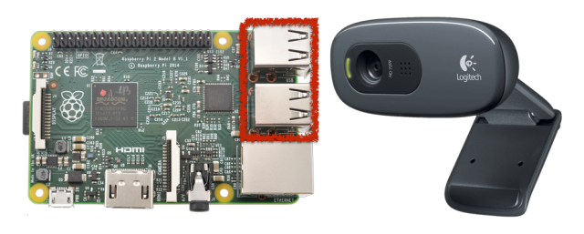
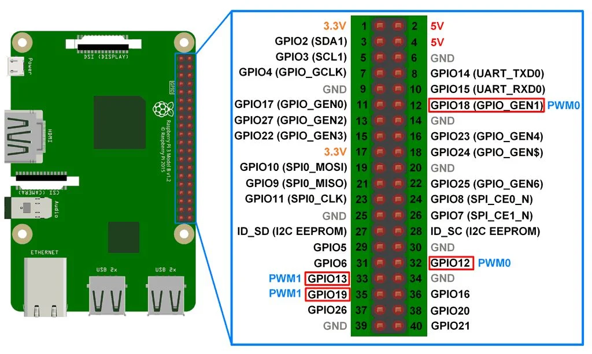
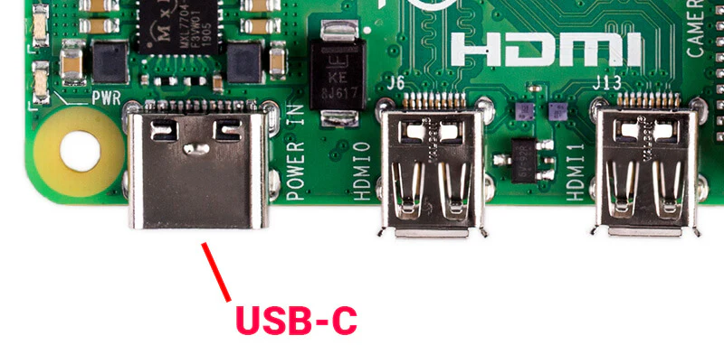

# Hardware Setup
## Connecting the USB Webcam to the Raspberry Pi
First, you need to connect the USB webcam to the Raspberry Pi:

1. Locate an available USB port on the Raspberry Pi.
2. Connect the USB webcam to the USB port on the Raspberry Pi.
3. Ensure the connection is secure.

## Connecting the Servo and ESC to the Integrated Adapter Board
Next, you have to connect the servo and ESC to the integrated adapter board:

1. Identify the integrated adapter board on the RC car chassis.
2. Connect the servo and ESC to the designated ports on the adapter board.
3. Ensure the connections are secure.

## Connecting Power for the Raspberry Pi
Finally, you need to connect power for the Raspberry Pi:

1. Locate the power input port on the Raspberry Pi.
2. Connect the power source (e.g., battery pack or power adapter) to the power input port.
3. Ensure the power connection is secure.

